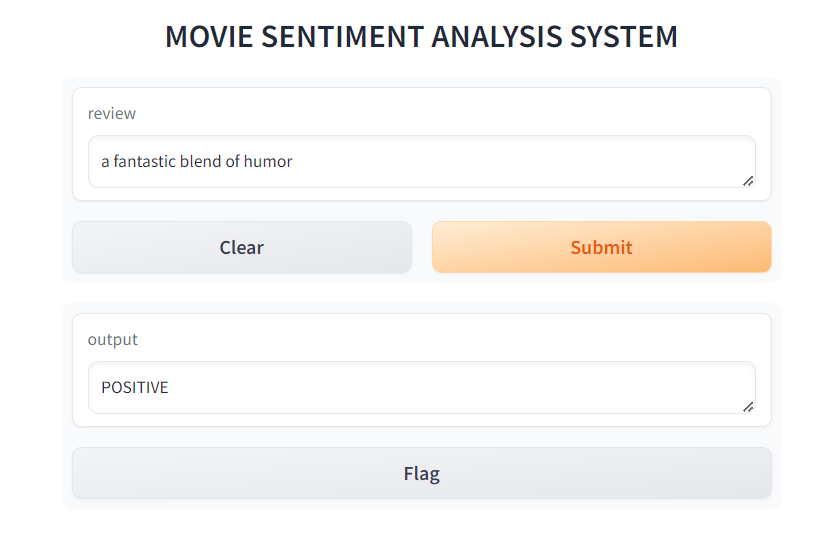
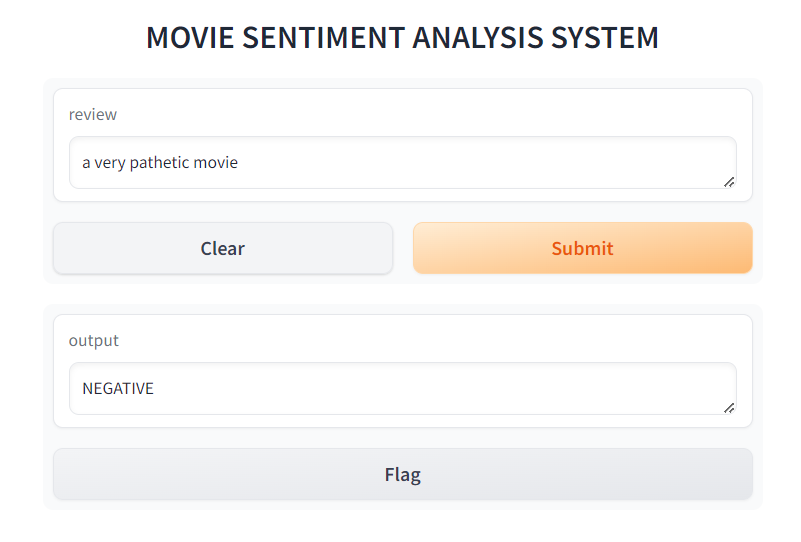

<h1 style="text-align:centre">SENTIMENT ANALYSIS ON MOVIE REVIEW SYSTEM</h1>

### Overview
The Movie Review System is a sentiment analysis application that utilizes natural language processing (NLP) and machine learning techniques to automatically evaluate the sentiment behind user reviews. This system classifies reviews as positive, negative, or neutral based on the text, providing deeper insights into audience perceptions of films.

### Features
- **Sentiment Classification:** Automatically classifies reviews into positive, negative, or neutral categories.
- **NLP Techniques:** Utilizes advanced natural language processing methods to analyze text.
- **Real-time Insights:** Generates an overall sentiment score for each movie, enhancing recommendations and displaying audience reactions.

### Getting Started

**Prerequisites**
- Python 3.x
- Jupyter Notebook
- Required libraries (see requirements.txt)
  
## Installation
1. **Clone the repository:**
   ```bash
   git clone https://github.com/Deepanshu8560/Movie-Review-system.git
2. **Navigate to the project directory:**
   ```bash
   cd Movie-Review-system
3. **Install the required libraries:**
   ```bash
   pip install -r requirements.txt
## Usage
1. **Open the Jupyter Notebook:**
   ```bash
   jupyter notebook
2. Run the Mov.ipynb notebook to start analyzing movie reviews.

## Dataset
- The system uses the IMDB Dataset for training and testing the sentiment analysis model. The dataset is included in the repository as IMDB Dataset.csv.

## Model
- The trained model is saved as model.h5, and the tokenizer used for text processing is saved as tokenizer.pkl.

## Contributing
- Contributions are welcome! Please feel free to submit a pull request or open an issue for any suggestions or improvements.





